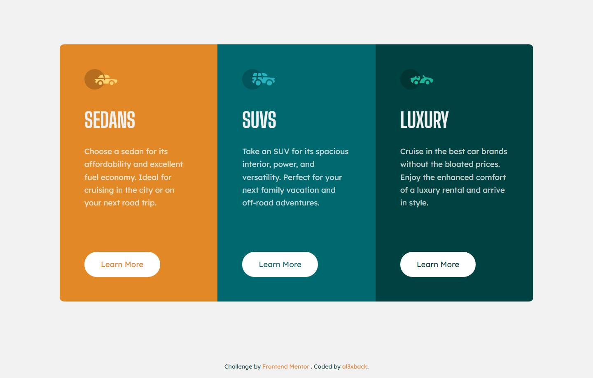

# Frontend Mentor - 3-column preview card component solution

This is a solution to the [3-column preview card component challenge on Frontend Mentor](https://www.frontendmentor.io/challenges/3column-preview-card-component-pH92eAR2-). Frontend Mentor challenges help you improve your coding skills by building realistic projects. 

## Overview

### The challenge

Users should be able to:

- View the optimal layout depending on their device's screen size
- See hover states for interactive elements

### Screenshot

### Links

- Solution URL: https://github.com/al3xback/3-column-card--Frontend-Mentor
- Live Site URL: https://al3xback.github.io/3-column-card--Frontend-Mentor

## My process

### Built with

- Semantic HTML5 markup
- Flexbox
- Mobile-first workflow
- Vue - JS library

## Author

- Frontend Mentor - [@al3xback](https://www.frontendmentor.io/profile/al3xback)
- Twitter - [@al3x_back](https://twitter.com/al3x_back)

